# Technical Documentation: PDF Questions Extractor

> A comprehensive guide to the architecture, design decisions, and technical nuances of the PDF Questions Extractor system.

---

## Table of Contents

1. [System Architecture](#system-architecture)
2. [Component Deep Dive](#component-deep-dive)
3. [Data Flow](#data-flow)
4. [Processing Modes](#processing-modes)
5. [Schema Design](#schema-design)
6. [API Architecture](#api-architecture)
7. [Prompt Engineering](#prompt-engineering)
8. [Concurrency Model](#concurrency-model)
9. [Token & Cost Management](#token--cost-management)
10. [Error Handling](#error-handling)
11. [Technical Nuances](#technical-nuances)
12. [Configuration Reference](#configuration-reference)

---

## System Architecture

### High-Level Architecture Diagram

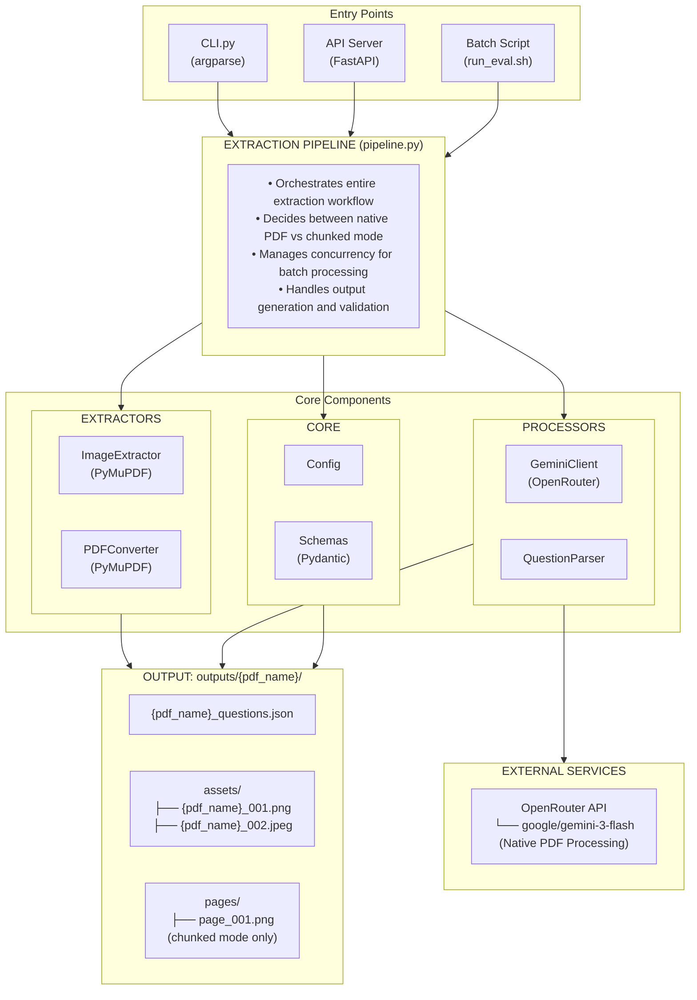

### Module Dependency Graph

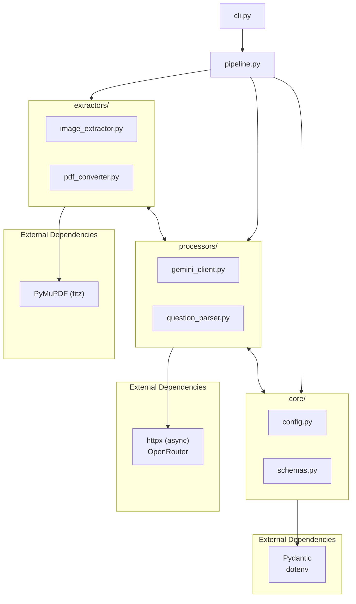

---

## Component Deep Dive

### 1. Extraction Pipeline (`src/pipeline.py`)

The central orchestrator that manages the entire extraction workflow.

```python
class ExtractionPipeline:
    """
    Main responsibilities:
    1. Determine processing mode (native PDF vs chunked)
    2. Coordinate extractors and processors
    3. Manage output directories
    4. Handle batch processing with concurrency control
    """
```

**Key Methods:**

| Method | Purpose |
|--------|---------|
| `process_pdf()` | Main entry point for single PDF processing |
| `_process_native_pdf()` | Send entire PDF to Gemini (≤30 pages) |
| `_process_large_pdf()` | Chunked processing for large PDFs |
| `process_batch()` | Concurrent processing with semaphore |

**Processing Decision Logic:**

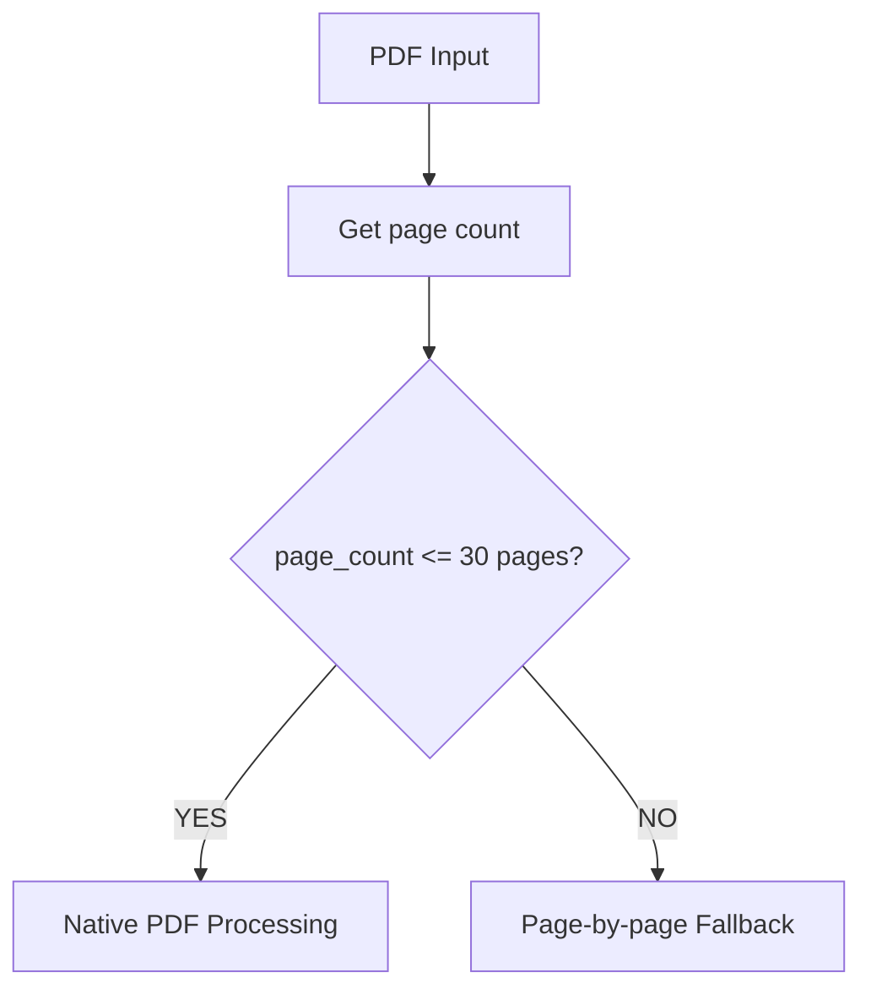

### 2. Gemini Client (`src/processors/gemini_client.py`)

Handles all communication with the OpenRouter API for Gemini 3.0 Flash.

**Key Features:**

```python
class GeminiClient:
    """
    - Native PDF processing via base64 encoding
    - Structured JSON output mode
    - Token usage tracking
    - Cost estimation
    - Automatic retry handling
    """
```

**API Request Structure:**

```python
payload = {
    "model": "google/gemini-3-flash-preview",
    "messages": [
        {"role": "system", "content": SYSTEM_PROMPT},
        {"role": "user", "content": [
            {"type": "text", "text": "Extract questions..."},
            {"type": "image_url", "image_url": {"url": pdf_data_url}}  # Base64 PDF
        ]}
    ],
    "temperature": 0.1,           # Low for deterministic extraction
    "max_tokens": 65536,          # Large for full document extraction
    "response_format": {"type": "json_object"}  # Structured output
}
```

**Token Usage Tracking:**

```python
@dataclass
class UsageStats:
    prompt_tokens: int = 0
    completion_tokens: int = 0
    total_tokens: int = 0
    generation_ids: List[str] = field(default_factory=list)
```

### 3. Image Extractor (`src/extractors/image_extractor.py`)

Extracts embedded images from PDFs using PyMuPDF.

**Extraction Process:**

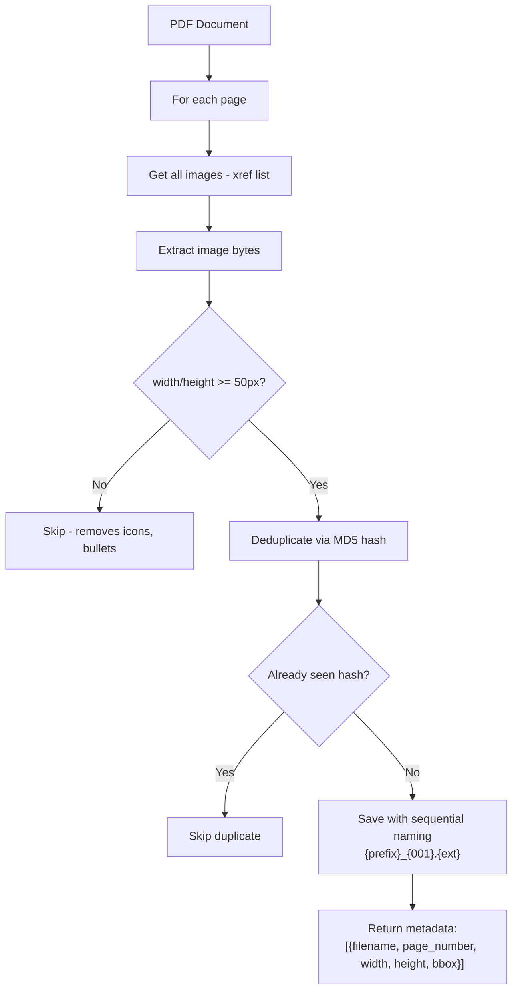

**Deduplication Logic:**

```python
# Prevent same image being saved multiple times
img_hash = hashlib.md5(image_bytes).hexdigest()[:12]
if img_hash in self._seen_hashes:
    continue  # Skip duplicate
self._seen_hashes.add(img_hash)
```

### 4. PDF Converter (`src/extractors/pdf_converter.py`)

Converts PDF pages to images (used in chunked mode).

```python
class PDFConverter:
    """
    - 300 DPI rendering for high-quality text recognition
    - PNG format for lossless output
    - Sequential page naming (page_001.png, page_002.png)
    """

    def __init__(self, dpi: int = 300):
        self.zoom = dpi / 72.0  # 72 is default PDF DPI
        self.matrix = fitz.Matrix(self.zoom, self.zoom)
```

### 5. Question Parser (`src/processors/question_parser.py`)

Post-processes extraction results with validation and enrichment.

**Key Responsibilities:**

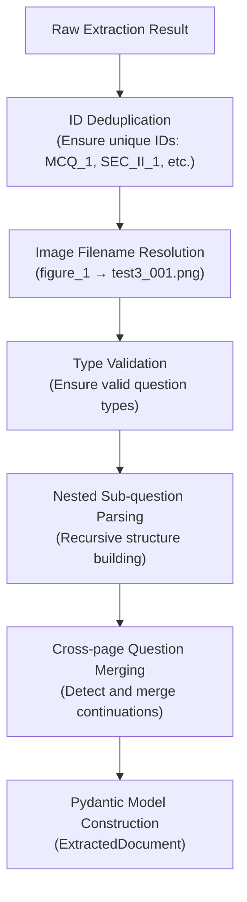

**Image Filename Mapping:**

```python
# Build flexible lookup mapping
mapping = {
    "1": "test3_001.png",           # By index
    "figure_1": "test3_001.png",    # By figure number
    "fig_1": "test3_001.png",       # Abbreviated
    "figure 1": "test3_001.png",    # With space
    "test3_001": "test3_001.png",   # By name
    ...
}
```

---

## Data Flow

### Complete Processing Flow

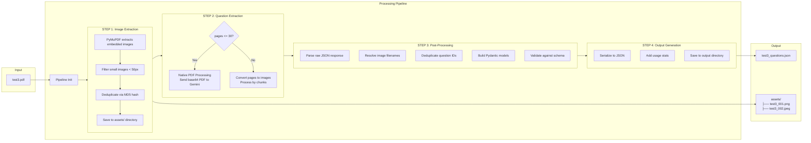

### Data Transformations

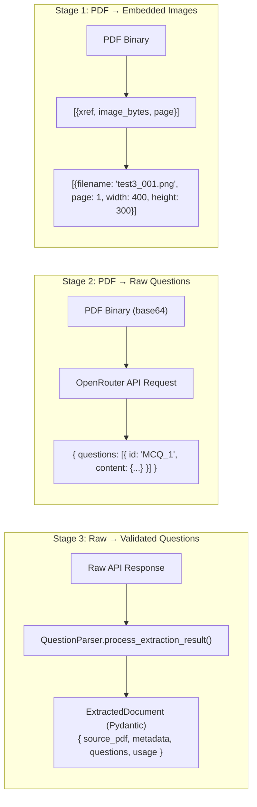

---

## Processing Modes

### Mode 1: Native PDF Processing (Default)

**When Used:** PDF has ≤30 pages

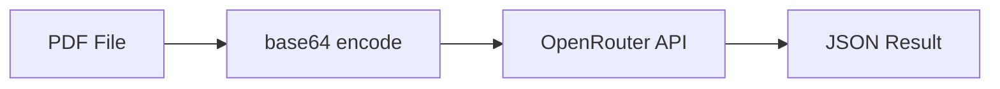

**Advantages:**
- ✓ Full document context (model sees all pages at once)
- ✓ Better section understanding
- ✓ No context loss between pages
- ✓ Simpler pipeline (no image conversion needed)
- ✓ Cross-page questions handled naturally

**Limitations:**
- ✗ Token limit constraints (large PDFs exceed limits)
- ✗ API cost scales with document size

### Mode 2: Page-by-Page Fallback

**When Used:** PDF has >30 pages

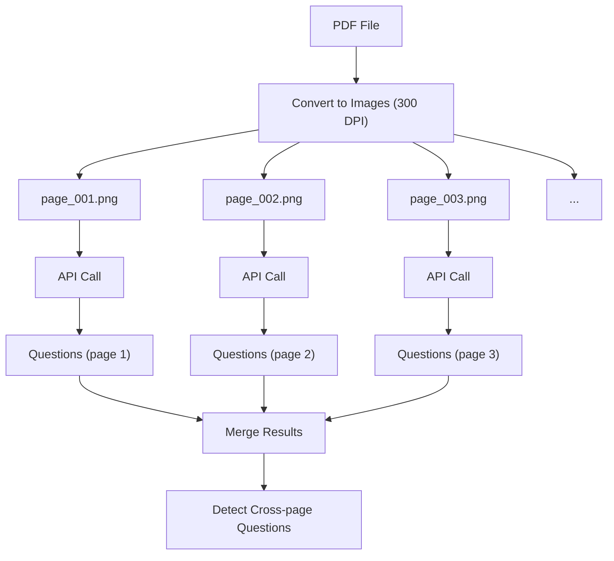

**Advantages:**
- ✓ Handles any PDF size
- ✓ More granular progress tracking

**Limitations:**
- ✗ Context loss between pages
- ✗ More API calls (higher latency)
- ✗ Cross-page question detection is heuristic-based

---

## Schema Design

### Entity Relationship Diagram

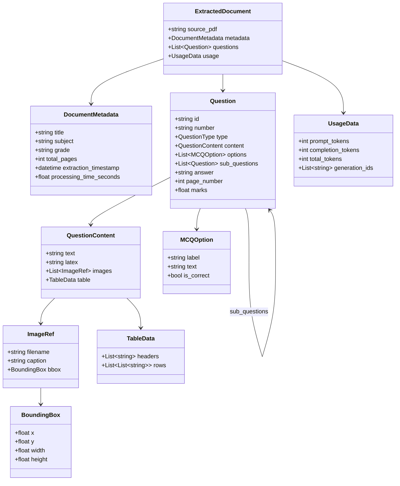

### Question ID Naming Convention

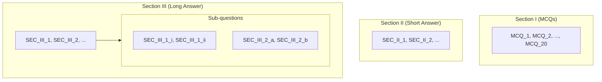

### Question Types

```python
QuestionType = Literal[
    "mcq",           # Multiple choice with options
    "short_answer",  # Brief response/fill in
    "long_answer",   # Extended response
    "multi_part",    # Question with sub-parts
    "fill_in_blank", # Complete sentence/equation
    "true_false",    # True/False question
    "matching",      # Matching question
    "numerical",     # Numerical answer required
    "proof",         # Mathematical proof required
    "other",         # Doesn't fit other categories
]
```

---

## API Architecture

### Endpoint Overview

| Endpoint | Method | Description |
|----------|--------|-------------|
| `/` | GET | Health check |
| `/health` | GET | Detailed health status with config |
| `/extract` | POST | Synchronous extraction (waits for completion) |
| `/extract/stream` | POST | SSE streaming (real-time progress updates) |
| `/extract/batch` | POST | Batch extraction (multiple PDFs) |
| `/schema` | GET | JSON Schema for output format |

### SSE Streaming Protocol

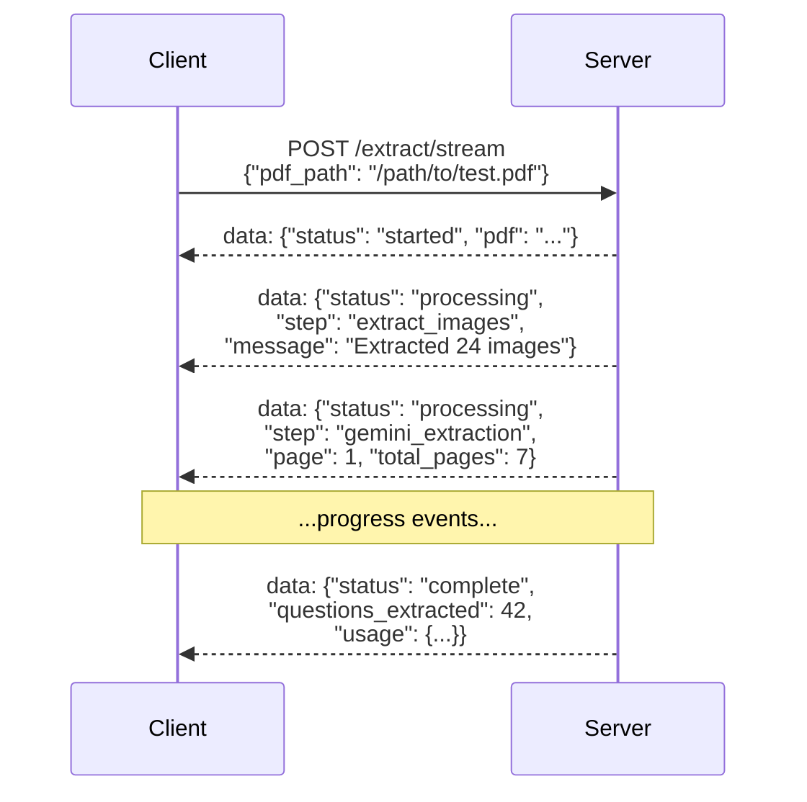

### Request/Response Examples

**Synchronous Extraction:**

```bash
# Request
curl -X POST http://localhost:8000/extract \
  -H "Content-Type: application/json" \
  -d '{"pdf_path": "/path/to/test3.pdf"}'

# Response
{
  "status": "ok",
  "output_json_path": "/outputs/test3/test3_questions.json",
  "assets_dir": "/outputs/test3/assets",
  "processing_time_seconds": 50.2
}
```

---

## Prompt Engineering

### System Prompt Structure

The system prompt is carefully engineered for reliable extraction:

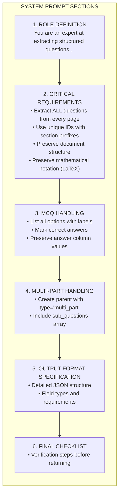

### Dynamic Image Reference Instructions

```python
# When images are extracted, inform the model about actual filenames
if extracted_images:
    image_list = [img.get("filename", "") for img in extracted_images]
    image_info = f"The following figures have been extracted: {image_list}.
                   Use these exact filenames when referencing figures."
else:
    image_info = "Reference figures by their label (e.g., 'Figure 1')."
```

### LaTeX Preservation Guidelines

```
Mathematical Notation Requirements:
─────────────────────────────────
• Triangle: $\Delta ABC$
• Angle: $\angle B = 50^\circ$
• Fraction: $\frac{a}{b}$
• Subscript/Superscript: $A_n$, $x^2$, $4AD^2$
• Greek letters: $\pi$, $\theta$, $\alpha$
• Congruent: $\cong$
• Parallel: $\parallel$
• Perpendicular: $\perp$
```

---

## Concurrency Model

### Batch Processing Architecture

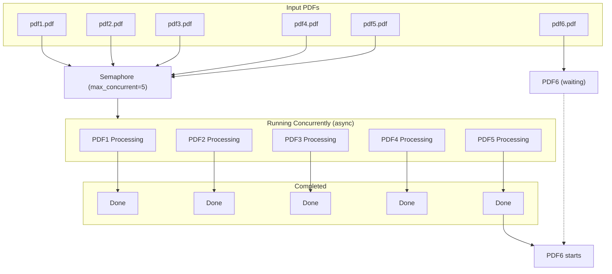

### Implementation

```python
async def process_batch(self, pdf_paths: List[str], max_concurrent: int = 5):
    semaphore = asyncio.Semaphore(max_concurrent)

    async def process_with_semaphore(pdf_path: str):
        async with semaphore:  # Acquire semaphore slot
            return await self.process_pdf(pdf_path)

    # Create all tasks
    tasks = [process_with_semaphore(path) for path in pdf_paths]

    # Run concurrently with exception handling
    results = await asyncio.gather(*tasks, return_exceptions=True)

    return results
```

### Thread Safety Considerations

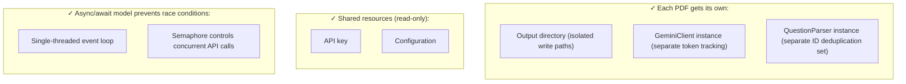

---

## Token & Cost Management

### Token Tracking Flow

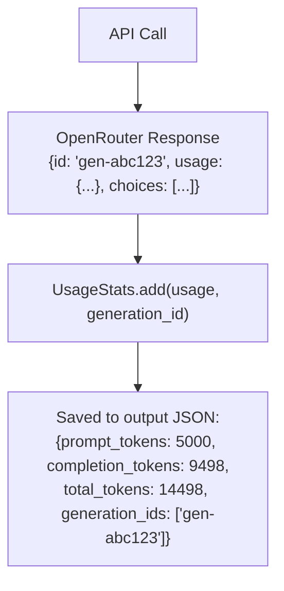

### Cost Estimation

```python
# Gemini 3 Flash pricing (via OpenRouter)
PRICE_PER_1M_INPUT_TOKENS = 0.50   # $0.50 per million input tokens
PRICE_PER_1M_OUTPUT_TOKENS = 3.00  # $3.00 per million output tokens

estimated_cost = (
    (prompt_tokens * 0.50 / 1_000_000) +
    (completion_tokens * 3.00 / 1_000_000)
)

# Example for test3.pdf:
# 5,002 prompt + 9,525 completion
# Cost: (5002 * 0.50 + 9525 * 3.00) / 1_000_000 = ~$0.031
```

---

## Error Handling

### Error Hierarchy

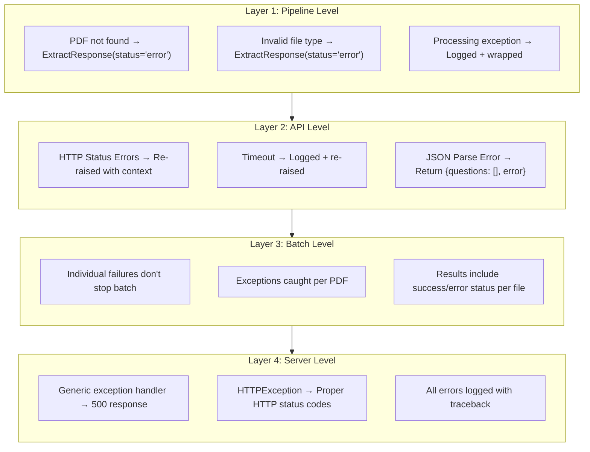

### Graceful Degradation

```python
# Batch processing continues even if individual PDFs fail
for i, result in enumerate(results):
    if isinstance(result, Exception):
        logger.error(f"Batch task failed: {result}")
        final_results.append(
            (pdf_paths[i], ExtractResponse(status="error", error=str(result)))
        )
    else:
        final_results.append(result)
```

---

## Technical Nuances

### 1. Native PDF Encoding

```python
def _encode_pdf(self, pdf_path: str) -> str:
    """
    PDFs are sent to OpenRouter as base64-encoded data URLs.
    This leverages Gemini's native PDF understanding capabilities.
    """
    with open(path, "rb") as f:
        pdf_data = base64.b64encode(f.read()).decode("utf-8")
    return f"data:application/pdf;base64,{pdf_data}"
```

### 2. Image Reference Resolution

The model may reference images generically (e.g., "figure_1") but we need actual filenames:

```python
# Build comprehensive mapping for flexible matching
mapping = {
    "1": "test3_001.png",
    "figure_1": "test3_001.png",
    "fig_1": "test3_001.png",
    "figure 1": "test3_001.png",
    "image_1": "test3_001.png",
    "test3_001": "test3_001.png",
    "test3_001.png": "test3_001.png",
}

# Resolution order:
# 1. Exact match
# 2. Lowercase match
# 3. Extract number from reference ("Figure 5" → "5")
# 4. Fall back to original reference
```

### 3. Cross-Page Question Detection

When using chunked mode, questions may span pages:

```python
def _looks_like_continuation(self, text: str) -> bool:
    """Detect if text is a continuation of previous question."""

    # Starts with lowercase letter
    if text[0].islower():
        return True

    # Starts with continuation words
    continuation_starters = ["and", "or", "but", "where", "such", "then"]
    first_word = text.split()[0].lower()
    if first_word in continuation_starters:
        return True

    return False
```

### 4. ID Deduplication

Prevent duplicate question IDs across sections:

```python
# Handle duplicate IDs by appending suffix
original_id = q_id
suffix = 1
while q_id in self._seen_ids:
    q_id = f"{original_id}_{suffix}"
    suffix += 1
self._seen_ids.add(q_id)
```

### 5. Image Deduplication

Prevent same image saved multiple times:

```python
# MD5 hash for duplicate detection
img_hash = hashlib.md5(image_bytes).hexdigest()[:12]
if img_hash in self._seen_hashes:
    continue  # Skip duplicate
self._seen_hashes.add(img_hash)
```

### 6. Temperature Setting

```python
"temperature": 0.1  # Low for deterministic, consistent extraction
```

Low temperature ensures:
- Consistent output structure
- Reproducible extractions
- Less creative "interpretation" of content

### 7. Max Token Configuration

```python
"max_tokens": 65536  # Generous limit for full document extraction
```

Large limit ensures:
- All questions can be extracted
- Long multi-part questions aren't truncated
- Tables and LaTeX aren't cut off

---

## Configuration Reference

### Environment Variables

| Variable | Default | Description |
|----------|---------|-------------|
| `OPENROUTER_API_KEY` | Required | API key for OpenRouter |
| `MAX_CONCURRENT_PDFS` | `5` | Maximum parallel PDF processing |
| `IMAGE_DPI` | `300` | Image rendering resolution |
| `LOG_LEVEL` | `INFO` | Logging verbosity |

### Internal Constants

| Constant | Value | Location |
|----------|-------|----------|
| `MAX_PAGES_FOR_NATIVE` | `30` | `pipeline.py` |
| `MAX_PAGES_PER_PDF` | `50` | `config.py` |
| `REQUEST_TIMEOUT` | `120` | `config.py` |
| `MIN_IMAGE_SIZE` | `50` | `image_extractor.py` |
| `PDF_DPI` | `72` | Standard PDF DPI |
| `RENDER_DPI` | `300` | `pdf_converter.py` |

### Output Structure

```
outputs/
└── {pdf_name}/
    ├── {pdf_name}_questions.json   # Main output
    ├── assets/                     # Extracted images
    │   ├── {pdf_name}_001.png
    │   ├── {pdf_name}_002.jpeg
    │   └── ...
    └── pages/                      # Page images (chunked mode)
        ├── page_001.png
        └── ...
```

---

## Performance Benchmarks

| Metric | Value | Notes |
|--------|-------|-------|
| **7-page PDF** | ~43s | Native PDF mode |
| **Processing rate** | ~7s/page | Average with native mode |
| **Concurrent PDFs** | 5 | Default semaphore limit |
| **Cost per PDF** | ~$0.01-0.06 | Depends on size |
| **Token efficiency** | ~2,100 tokens/page | Average |

### Native vs Page-by-Page Comparison

| Aspect | Native PDF | Page-by-Page |
|--------|------------|--------------|
| Questions extracted | **42** | 33 |
| MCQs captured | **20/20** | 11/20 |
| Processing time | **~43s** | ~74s |
| Context quality | **Full document** | Per-page only |
| Cross-page questions | **Automatic** | Heuristic merge |

---

*Last updated: December 2024*

